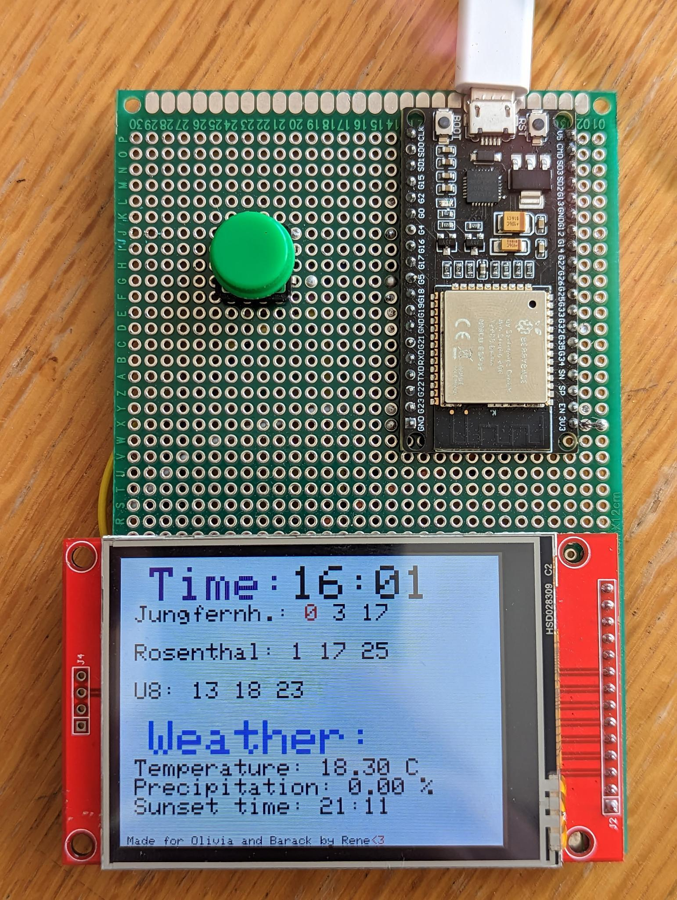

# Monitor for Bus Arrivals in Berlin
## Description
This is a quick and dirty project that I made for a friend. 
The parts cost less than 20€ and it took me about 8 hours to build it.

The Project uses a small Go Api hosted on the free tier of fly.io to fetch the data from the [BVG API](https://v6.bvg.transport.rest/) and [Open-Meteo.org](https://open-meteo.com/en/docs).

The Esp32 is connected to a 240x320 TFT Display and wifi. It fetches the data every 5 seconds from the API and displays it on the screen.

